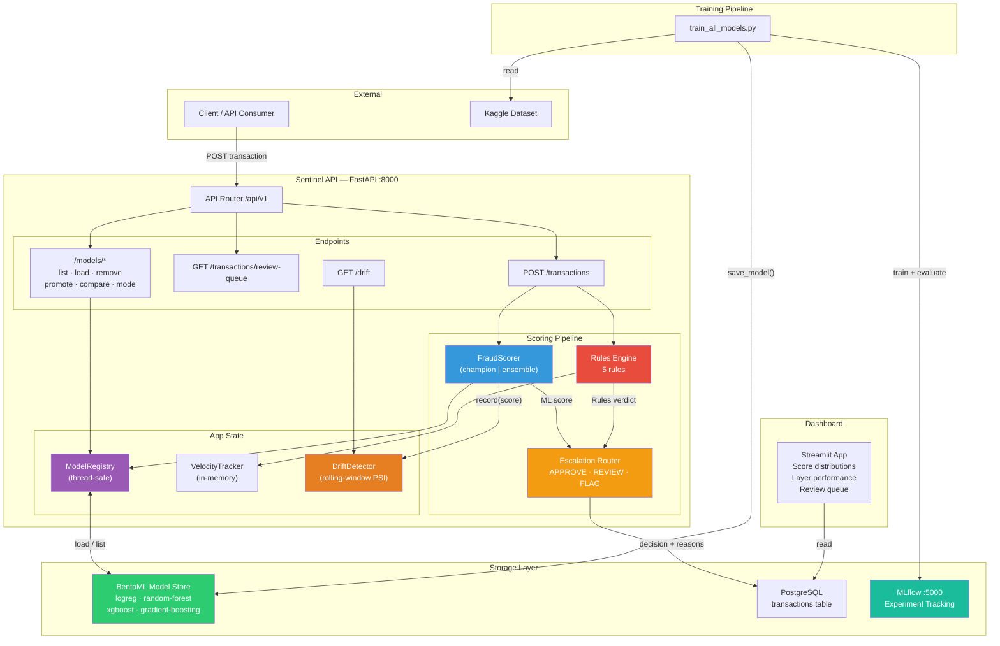
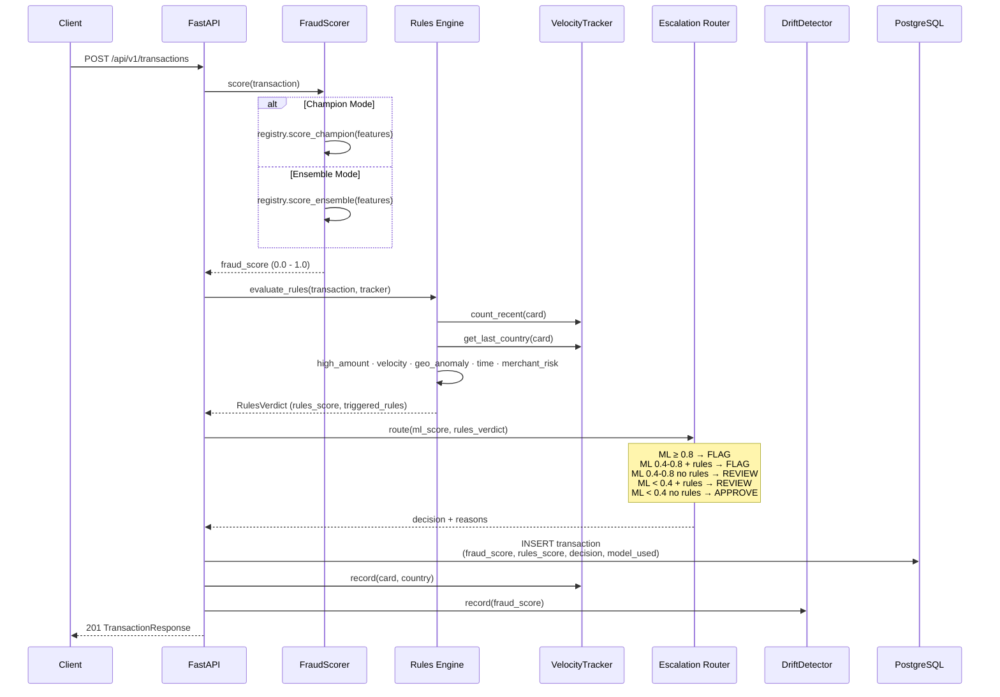
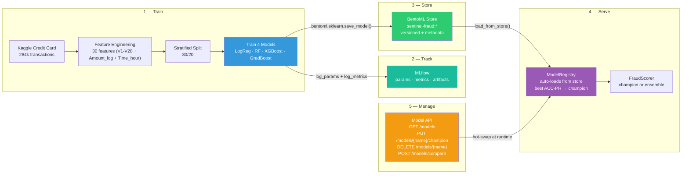

# Sentinel Architecture

## System Overview



## Transaction Scoring Flow



## Model Training & Promotion



## Model Lifecycle

```
┌─────────────────────────────────────────────────────────────────┐
│                        MODEL LIFECYCLE                          │
├─────────────────────────────────────────────────────────────────┤
│                                                                 │
│  TRAIN            STORE             SERVE            MANAGE     │
│  ─────            ─────             ─────            ──────     │
│                                                                 │
│  train_all_  ──►  BentoML     ──►  ModelRegistry  ◄──  API     │
│  models.py        Store            (in memory)        Endpoints │
│                   (on disk)                                     │
│       │                │                │                │      │
│       │                │                │                │      │
│       ▼                ▼                ▼                ▼      │
│                                                                 │
│  MLflow         sentinel-fraud:    Champion mode    Load new    │
│  Experiment     · logreg           Ensemble mode    Remove bad  │
│  Tracking       · random-forest    Score all        Promote     │
│                 · xgboost          Compare          Switch mode │
│                 · grad-boosting                                 │
│                                                                 │
│  Metrics:       Each tagged with:  Auto-selects     Hot-swap    │
│  AUC-PR         · framework        best AUC-PR     without     │
│  AUC-ROC        · metrics           as champion     restart    │
│  F1             · dataset                                       │
│  Precision                                                      │
│  Recall                                                         │
│                                                                 │
└─────────────────────────────────────────────────────────────────┘
```

## Decision Matrix

```
                    ┌─────────────────────────────────────┐
                    │         ESCALATION ROUTING           │
                    ├─────────────────────────────────────┤
                    │                                     │
                    │  ML Score     Rules      Decision   │
                    │  ─────────    ─────      ────────   │
                    │  ≥ 0.8        any    →   🔴 FLAG    │
                    │  0.4 – 0.8    yes    →   🔴 FLAG    │
                    │  0.4 – 0.8    no     →   🟡 REVIEW  │
                    │  < 0.4        yes    →   🟡 REVIEW  │
                    │  < 0.4        no     →   🟢 APPROVE │
                    │                                     │
                    └─────────────────────────────────────┘

    Rules Engine (5 independent rules):
    ┌──────────────────┬────────┬──────────────────────────┐
    │ Rule             │ Weight │ Trigger                  │
    ├──────────────────┼────────┼──────────────────────────┤
    │ High Amount      │ 0.4/0.7│ > $5k / > $10k          │
    │ Velocity         │ 0.6    │ 3+ txns in 10 min       │
    │ Geo Anomaly      │ 0.3/0.5│ High-risk country /     │
    │                  │        │ country change           │
    │ Time Anomaly     │ 0.2    │ 1am – 5am               │
    │ Merchant Risk    │ 0.3    │ Risky category + > $2k   │
    └──────────────────┴────────┴──────────────────────────┘
    Aggregate: rules_score = min(1.0, Σ triggered weights)
```

## Infrastructure

```
┌──────────────────────────────────────────────────────────┐
│                    docker-compose                        │
├──────────────────────────────────────────────────────────┤
│                                                          │
│  ┌─────────────┐  ┌─────────────┐  ┌─────────────────┐  │
│  │ PostgreSQL   │  │ Sentinel API│  │ MLflow Server   │  │
│  │ :5432        │  │ :8000       │  │ :5000           │  │
│  │              │  │             │  │                 │  │
│  │ transactions │  │ FastAPI     │  │ Experiments     │  │
│  │ table        │◄─┤ + BentoML  │  │ Params/Metrics  │  │
│  │              │  │   Store     │  │ Artifacts       │  │
│  └─────────────┘  └─────────────┘  └─────────────────┘  │
│                          │                               │
│                    ┌─────┴──────┐                        │
│                    │ Streamlit  │                        │
│                    │ Dashboard  │                        │
│                    └────────────┘                        │
└──────────────────────────────────────────────────────────┘
```
